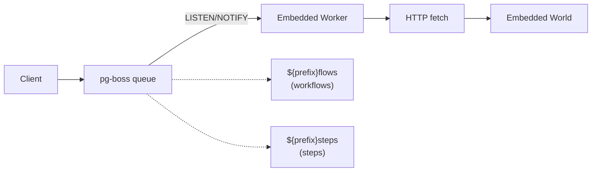
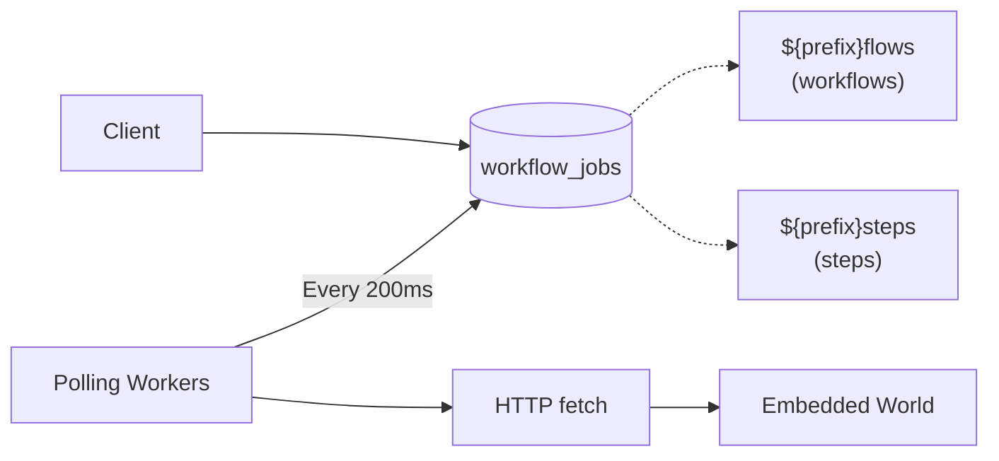

# How SQL World Works

This document explains the architecture and components of the SQL world implementation for workflow management, supporting PostgreSQL, MySQL, and SQLite.

## Architecture Overview

The SQL world uses an **adapter pattern** to support multiple SQL databases while maintaining a consistent API. Each database has specific adapters for:

1. **Database Client** - Connection and query execution
2. **Schema** - Database-specific Drizzle ORM schemas
3. **Queue** - Job queue implementation
4. **Streaming** - Real-time or polling-based streaming

## Database Adapters

### PostgreSQL Adapter
- **Client**: `postgres` (Postgres.js)
- **ORM**: Drizzle ORM with PostgreSQL driver
- **Queue**: pg-boss (LISTEN/NOTIFY-based)
- **Streaming**: LISTEN/NOTIFY (real-time)

### MySQL Adapter
- **Client**: `mysql2`
- **ORM**: Drizzle ORM with MySQL driver
- **Queue**: Table-based polling (200ms intervals)
- **Streaming**: Table-based polling (200ms intervals)

### SQLite Adapter
- **Client**: `better-sqlite3`
- **ORM**: Drizzle ORM with SQLite driver
- **Queue**: Table-based polling (200ms intervals)
- **Streaming**: Table-based polling (200ms intervals)

## Schemas

Each database has its own schema file in `src/schema/`:

- `postgres.ts` - PostgreSQL-specific types (pgEnum, bytea, jsonb)
- `mysql.ts` - MySQL-specific types (varchar with lengths, blob, json)
- `sqlite.ts` - SQLite-specific types (text with json mode, integer timestamps)

All schemas are maintained by [Drizzle ORM](https://orm.drizzle.team/) and can be migrated or pushed using Drizzle Kit.

### Common Tables

All databases share these tables:

- `workflow_runs` - Workflow execution records
- `workflow_events` - Event log for workflows
- `workflow_steps` - Step execution records
- `workflow_hooks` - Webhook/hook management
- `workflow_stream_chunks` - Streaming data chunks
- `workflow_jobs` - Queue jobs (for MySQL/SQLite)

## Job Queue System

### PostgreSQL (pg-boss)



- Uses pg-boss for robust queue management
- Real-time job processing via LISTEN/NOTIFY
- Built-in retry logic and job archiving
- Minimal database polling overhead

### MySQL/SQLite (Table-based)



- Uses `workflow_jobs` table for queue storage
- Workers poll database every 200ms
- Job locking via `lockedUntil` timestamp with UPDATE + WHERE
- Retry logic with exponential backoff (capped at 60s)
- Maximum 3 attempts per job

**Job States:**
- `pending` - Waiting to be processed
- `processing` - Currently being executed
- `completed` - Successfully finished
- `failed` - Failed after max retries

**Locking Mechanism:**
```sql
UPDATE workflow_jobs
SET status = 'processing', lockedUntil = NOW() + 30 seconds
WHERE id = ? AND status = 'pending'
  AND (lockedUntil IS NULL OR lockedUntil < NOW())
```

## Streaming

### PostgreSQL (LISTEN/NOTIFY)

Real-time data streaming via **PostgreSQL LISTEN/NOTIFY**:

- Stream chunks stored in `workflow_stream_chunks` table
- `pg_notify` triggers sent on writes to `workflow_event_chunk` topic
- Subscribers receive instant notifications and fetch chunk data
- ULID-based ordering ensures correct sequence
- Single connection for listening, with EventEmitter for distribution
- **Zero polling overhead** - truly real-time

### MySQL/SQLite (Polling)

Polling-based streaming:

- Stream chunks stored in `workflow_stream_chunks` table
- Workers poll table every 200ms for new chunks
- Track `lastSeenChunkId` per stream to avoid reprocessing
- ULID ordering maintains correct sequence
- Automatic cleanup when EOF is reached
- **Low overhead** - 200ms polling is cheap and provides good responsiveness

**Polling Loop:**
```typescript
setInterval(async () => {
  const newChunks = await db
    .select()
    .from(streams)
    .where(and(
      eq(streams.streamId, streamId),
      gt(streams.chunkId, lastSeenChunkId)
    ))
    .orderBy(streams.chunkId);

  for (const chunk of newChunks) {
    emitChunk(chunk);
    lastSeenChunkId = chunk.id;
  }
}, 200);
```

## Worker Setup

Call `world.start()` to initialize queue workers. When `.start()` is called:

1. **PostgreSQL**: pg-boss workers start and listen via LISTEN/NOTIFY
2. **MySQL/SQLite**: Polling workers start with 200ms intervals

Workers then:
1. Receive or poll for jobs
2. Make HTTP fetch calls to embedded world endpoints
3. Execute workflow or step logic
4. Update job status in database

In **Next.js**, add to `instrumentation.ts|js`:

```ts
// instrumentation.ts

if (process.env.NEXT_RUNTIME !== "edge") {
  import("workflow/api").then(async ({ getWorld }) => {
    // start listening to the jobs.
    await getWorld().start?.();
  });
}
```

## Performance Characteristics

### PostgreSQL
- **Best for**: Production workloads requiring low latency
- **Queue latency**: Near-instant (LISTEN/NOTIFY)
- **Stream latency**: Real-time
- **Overhead**: Minimal (event-driven)
- **Scalability**: Excellent (pg-boss handles high throughput)

### MySQL
- **Best for**: Most production workloads
- **Queue latency**: ~200ms average
- **Stream latency**: ~200ms average
- **Overhead**: Low (polling is cheap)
- **Scalability**: Good (horizontal scaling with multiple workers)

### SQLite
- **Best for**: Development and single-process deployments
- **Queue latency**: ~200ms average
- **Stream latency**: ~200ms average
- **Overhead**: Minimal (in-process)
- **Scalability**: Limited (single file, table locking)
- **Note**: Not recommended for multi-process scenarios

## Implementation Details

### Adapter Factory Pattern

The `createWorld()` function uses factory pattern to instantiate correct adapters:

```typescript
const dbType = config.databaseType || detectDatabaseType(config.connectionString);
const schema = getSchema(dbType);
const adapter = await createAdapter(dbType, config.connectionString, schema);
const queue = await createQueueAdapter(dbType, adapter, schema, config);
const streamer = createStreamingAdapter(dbType, adapter, schema);
```

### Auto-Detection

Database type is auto-detected from connection string:

- `postgres://` or `postgresql://` → PostgreSQL
- `mysql://` → MySQL
- Everything else (file path or `:memory:`) → SQLite

### Backward Compatibility

The package maintains backward compatibility with `@workflow/world-postgres`:

- Supports old environment variables (`WORKFLOW_POSTGRES_*`)
- Exports `PostgresWorldConfig` type alias
- Legacy `queue.ts` and `streamer.ts` files marked as deprecated

## Extending or Forking

To add support for another database or modify behavior:

1. Create a new database adapter in `src/adapters/`
2. Create database-specific schema in `src/schema/`
3. Implement queue adapter in `src/queue/`
4. Implement streaming adapter in `src/streaming/`
5. Update factory functions to include new database type

All database operations use Drizzle ORM, so you can:
- Replace with any other ORM
- Use raw SQL queries
- Implement custom query builders

The adapter pattern makes it easy to swap implementations while maintaining the same World API.
